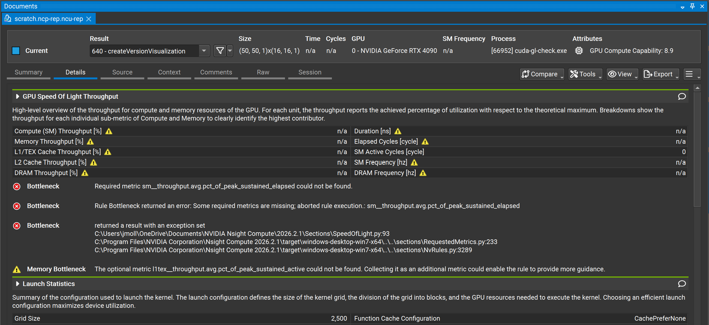
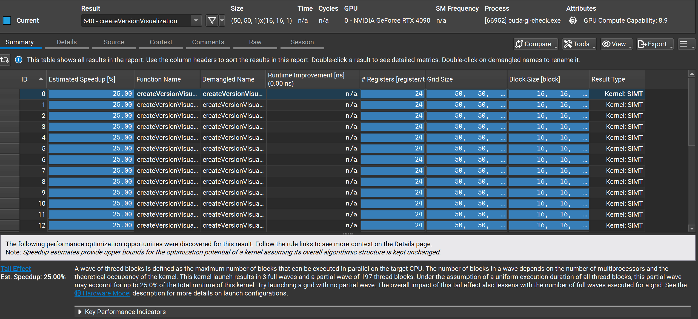
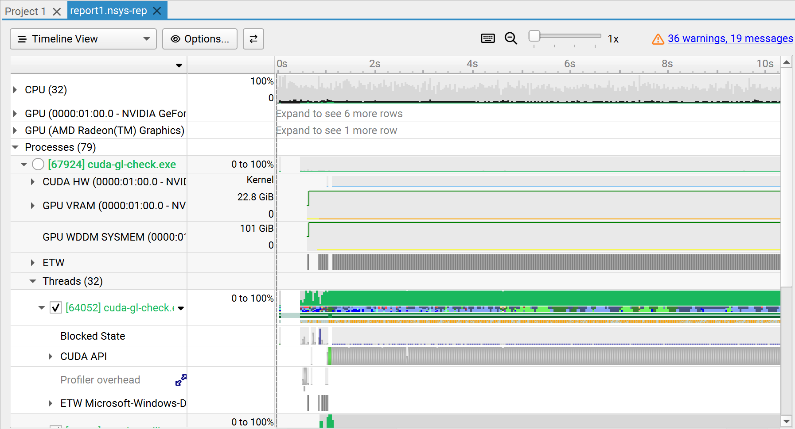
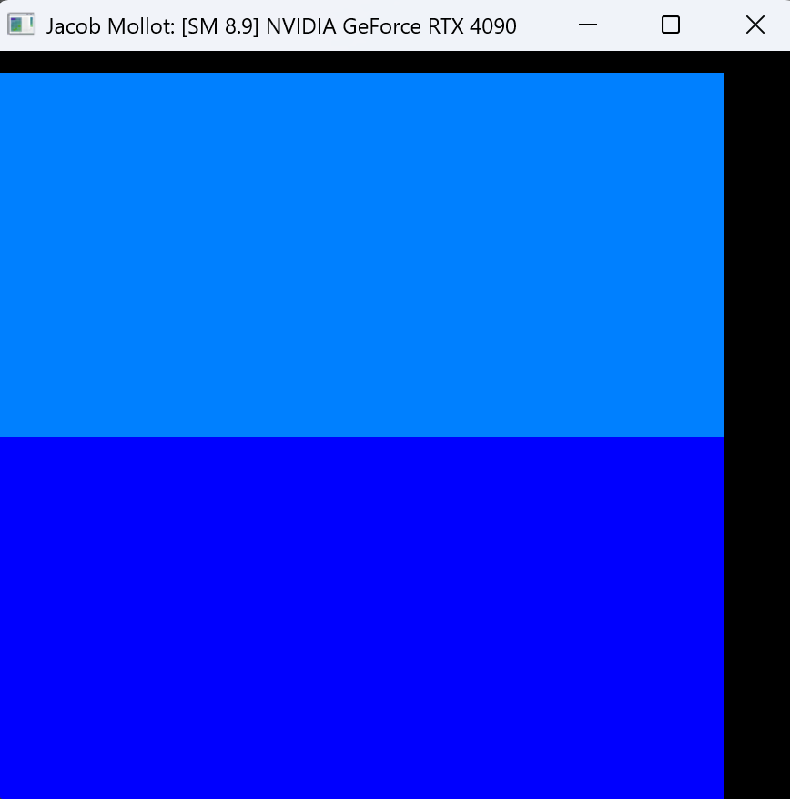
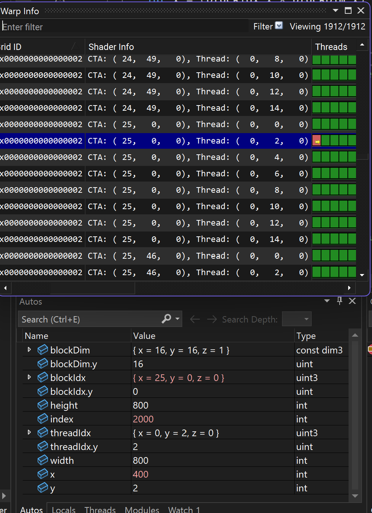
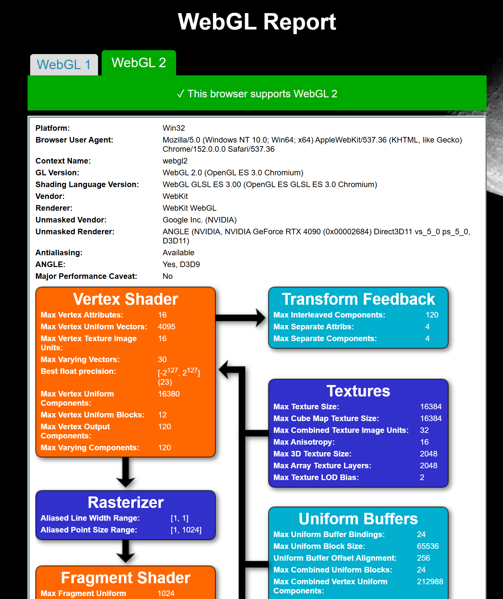
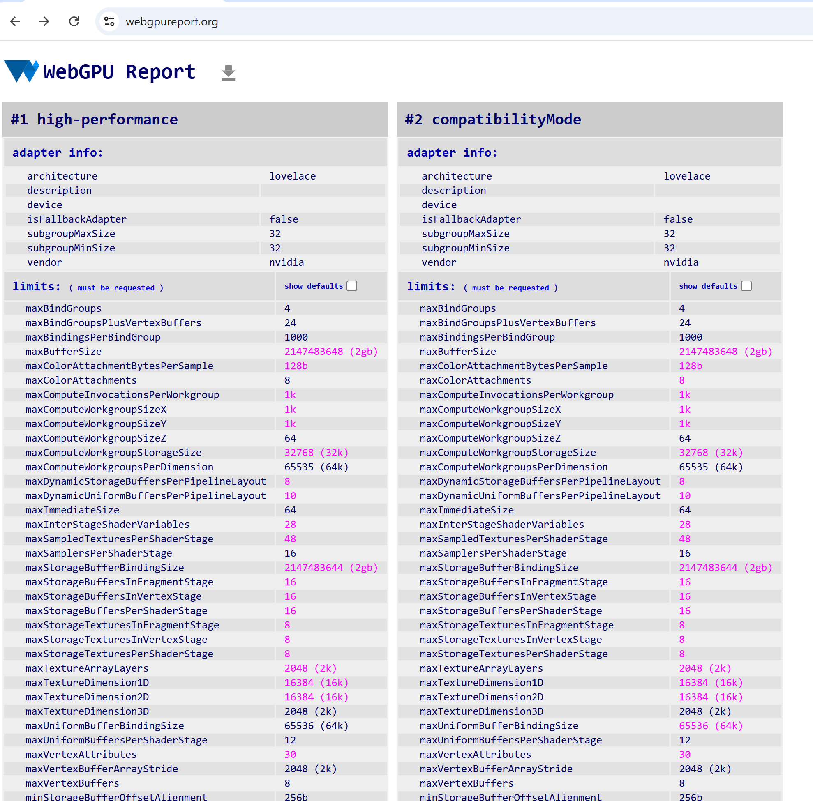

# Project 0 Getting Started

**University of Pennsylvania, CIS 5650: GPU Programming and Architecture, Project 0**

* Jacob Mollot

  * [LinkedIn](www.linkedin.com/in/jacob-mollot-840129182), [Social Media](https://www.instagram.com/come0ndeath27), [Youtube](https://youtu.be/QC5NqphEY24?si=FwLU1xXCVy8uT3Yv), etc.
* Tested on Person Computer:

  * Windows 11
  * AMD Ryzen 9 7950X 16-core Processor @ 4.50 GHz
  * 128 GB RAM @ 3600 MT/s
  * NVIDIA GeForce RTX 4090 (24GB), cc: 8.9

### 

* Images

